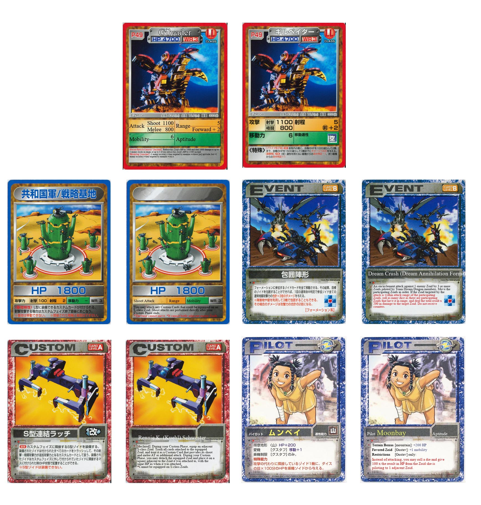

This was a program to see if I could automate replaceing the text of Japanese cards with English words. I made this to help with another person’s project of porting a Japanese card and board game over to an American audience. They supplied me with the translated card database (in Excell) and a bunch of scans of cards.

I started by making a photoshop png mask for each card type to cover up the Japanese words. I then found the size of each area I was going to put text in and created rules to put the text there. Often time these rules dealt with text wrapping and seeing if the text could fit in a given box if not it would try the text again at the next smaller font size. For some cards I set up rules to mirror the coloring of the Japanese cards.

Due to Japanese text being data dense (2 characters or less can be a whole word), many of the translated words had to be shortened to fit in areas.

Although the text is hard coded into the tests the project was planned to have it read from the database of text and match them with the names of scanned cards.

Version control of this project was done by incrementing the file numbers.
________________________________________
The final working versions for each type of card are:

Zoid - test_overlay_zoid_database_test_6 - this show the program placing text for a long list of zoids onto the card for Gilvader.

Mobile Base - test_overlay_mobile_base_phase_6 - this shows the mask on the card for Pingitrain, as well as the measurement and text readouts and the resizing needed from the scan.

Pilot - pilot_overlay_test_phase_three - this show the overlay for Moonbay, aptitude was not transferred as that was still being discussed on how to display.

Event - event_overlay_test - this does the event Dream Crush, making sure to work around the symbol on the card; this was also used to point out that several names should be redune when made.

Base - base_overlay_test - this is one of the none-mobile bases, the name was not done as translated it is way to small text.

Custom Part - custom_overlay_test_phase_2 - this is the part for the S-class coupling clamp, emphisis was put on getting the colors of text to match.
________________________________________
I proved I could do the task but concluded that the game might not get done, so set this aside till it looked like the game would be made.

